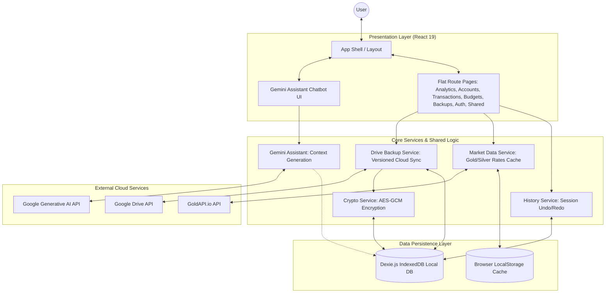

# MoneyGrid
 
A Progressive Web Application for personal finance management, built with React, TypeScript, and modern web technologies.

## 📸 Screenshots & Demo

**Live Demo:** [https://personal-finance-pwa.netlify.app/](https://personal-finance-pwa.netlify.app/)

### Desktop View


### Mobile View


## 🌟 Features

- 📱 **Progressive Web App (PWA)**: Installable on all devices with full offline support.
- 💾 **Offline-First & IndexedDB**: Instant client-side responsiveness powered by Dexie.js (IndexedDB). No mandatory auth gating; works entirely offline and seeds default values from `public/data.json`.
- 🎨 **Dynamic Bootswatch Engine**: Switch between 25+ Bootswatch theme presets dynamically with the **United** theme loaded by default, featuring 100% flicker-free head reloading.
- 🔄 **Undo/Redo System**: Full session-based multi-level undo/redo history to prevent accidental data loss.
- ☁️ **Decoupled Google Drive Cloud Sync**:
  - Optional, opt-in cloud backups accessible directly from the layout header sync button.
  - **Smart Sync Merging**: Intelligent prompts when first logging in to either restore cloud backups or merge/upload current local changes.
  - **Robust Error Bubbling**: Rethrown oauth/connection errors are handled by custom UI toasts to display descriptive error reasons (like missing `VITE_GOOGLE_CLIENT_ID`) instead of false success messages.
- 🤖 **AI Assistant**: Built-in chatbot powered by Google Gemini to analyze your finances.
  - **Natural Language Queries**: Ask questions about your net worth, spending, etc.
  - **Image Rendering**: View AI-generated images directly in the chat.
  - **Dynamic Model Selection**: Auto-fetches available models based on your API Key.
  - **Secure Configuration**: Bring your own API Key. Keys are encrypted and stored locally.
  - **Read-Only Mode**: AI has read access to give insights but cannot modify your data for safety.
- 🎯 **Financial Freedom Tracker**:
  - **FI Number Calculation**: Automatically calculates your target corpus using the 3.5% rule (34.3x annual expenses).
  - **Visual Progression**: Track your journey through financial independence stages with an interactive KPI.
- 🧪 **Tools**: Experimental tools and calculators.
  - **REITs Simulator**: Simulate Real Estate Investment Trust returns.
  - **Commodity Rates**: Live Gold (10g) and Silver (1kg) rates (powered by GoldAPI, cached daily).
- 📊 **Analytics**: Visual analytics and reports using Recharts.
- 🔒 **Security**: Biometric app lock and local data encryption.
- 📱 **Responsive Design**: Optimized for mobile, tablet, and desktop.
- 📈 **Projections**: Advanced financial projection tools (Retirement, Net Worth).

## 🏗️ Architecture



## 📂 Project Structure

To keep the codebase simple and highly scalable for new developers, the dual `domains/` and `shared/` directory structure has been replaced by a flat, clean, role-based folder hierarchy:

```text
src/
├── app/                  # Application bootstrappers, global providers, root routing and layouts
│   └── __tests__/        # Integration tests for core application flow
├── components/           # Reusable stand-alone UI elements, grouped logically:
│   ├── common/           # Shared generic inputs, selectors, tables, gauges, CustomPieChart, GenericCRUDPage, HolderSelect, AccountSelect, AssetClassSelect
│   ├── layout/           # BasePage templates, core Layout shell, error boundaries, navigation controls
│   ├── widgets/          # Dynamic standalone card widgets (Gold Calculator, Daily Tips, Gold Rates)
│   └── [domain]/         # Domain-focused visual panels (e.g. analytics, backups, budgets, auth, ai)
├── contexts/             # Shared React state providers (Theme, Auth, BioLock, DashboardData)
├── data/                 # Static data sources, calculators data, and default tips (reitData, financialTips)
├── hooks/                # Shareable React hooks (useMobile, useUndoRedo, useAuth, useDashboardData)
├── infrastructure/       # Core low-level database configurations:
│   ├── crypto/           # Cryptographic infrastructure helpers
│   └── db/               # Dexie.js database instances, schemas definitions, types, and version migrations
├── pages/                # Page views representing route endpoints, flat and simple to find:
│   ├── analytics/        # Dashboard, FIRE page, asset projections, tools, and systematic withdrawal page (SwpPage)
│   ├── accounts/         # Portfolios, holdings, bank accounts, holders, asset classes, and REITs
│   ├── transactions/     # Income flows, cash flow merging, upcoming expenses, insurances, and types pages
│   ├── budgets/          # Goals tracking and monthly category budget cards
│   ├── backups/          # Google Drive sync panel, debug logs console, and DB query builder
│   ├── auth/             # Login/Credential lock portal
│   └── shared/           # Generic core pages (e.g., About page, Finance Guidelines)
├── service-worker/       # PWA custom service worker and Workbox registration precaching
├── services/             # Shared business services (driveSync, googleDrive, aiService, configService, marketData)
├── styles/               # Global styling system, scss variables, design theme layouts
├── types/                # Centralized interface definitions (UI columns, type models, crud.types)
├── utils/                # Pure utility functions (encryption, financialUtils, notifications, numberUtils, dateUtils)
└── test/                 # Test setups and general Vitest environment definitions
```

## 🚀 Tech Stack

- **Frontend:** React 19, TypeScript
- **AI:** Google Gemini API (Flash/Pro models)
- **Build Tool:** Vite 7
- **Styling:** Bootstrap 5, React Bootstrap, SASS
- **State Management:** React Context + Hooks
- **Database:** Dexie.js (IndexedDB wrapper)
- **Charts:** Recharts
- **Routing:** React Router DOM
- **PWA:** Vite PWA Plugin
- **Icons:** React Icons

## 📥 Installation

1. Clone the repository:

```bash
git clone https://github.com/swapnil-bhamat/Personal-Finance-PWA.git
cd Personal-Finance-PWA
```

2. **Configure Environment Variables:**

   Create a `.env` file from the example and update it with your credentials:

   ```bash
   cp .env.example .env
   ```

   Open `.env` and fill in your details (Google Client ID, etc.).

3. Install dependencies:

```bash
npm install
```

4. Start the development server:

```bash
npm run dev
```

## 🛠️ Available Scripts

- `npm run dev`: Start development server
- `npm run build`: Build for production
- `npm run serve`: Preview production build
- `npm run lint`: Lint source files
- `npm run dev:netlify`: Start Netlify development environment
- `npm run functions:serve`: Serve Netlify functions locally

## 📱 PWA Features

- **Offline First**: Works without internet connection.
- **Installable**: Add to home screen on iOS and Android.
- **Background Sync**: Syncs data when connection is restored.
- **App-like Experience**: Full-screen mode and smooth transitions.

## 🎨 Design System

The application features a modern, elite **Bootswatch Theme Engine** built directly on top of **Bootstrap 5** and **React Bootstrap**:
- **Dynamic 25+ Preset Themes**: Users can instantly skin the entire interface using a curated list of Bootswatch presets loaded dynamically from jsDelivr CDN.
- **Zero-Flash Pre-Loading**: A synchronous inline head script restores the saved theme instantly from `localStorage` upon reload, preventing any flash-of-unstyled-content (FOUC).
- **Theme-Agnostic High Legibility**: Category cards, row sub-palettes, and sidebars utilize high-contrast native text-emphasis variables (`var(--bs-primary-text-emphasis)`) and theme-compliant layouts. Standard container styling uses `bg-body-secondary` to guarantee readable typography in both light and dark modes.

## 🔒 Security & Privacy

- **Local-First**: All data is stored locally on your device using IndexedDB.
- **Biometric Lock**: Optional biometric authentication for app access.
- **Private Sync**: Data is encrypted and stored in your personal Google Drive. OAuth access tokens are bound strictly to sessionStorage to prevent theft.
- **No Tracking**: No external analytics or tracking scripts.
- **AI Privacy**: API Keys and credentials inside IndexedDB are locally encrypted using the Web Crypto API (AES-256-GCM) with biometric-backed WebAuthn PBKDF2 key derivation.
- **Session-Bound Storage**: Google Drive access tokens are held in sessionStorage and fully destroyed when the browser window closes.

## 🤝 Contributing

1. Fork the repository
2. Create your feature branch (`git checkout -b feature/AmazingFeature`)
3. Commit your changes (`git commit -m 'Add some AmazingFeature'`)
4. Push to the branch (`git push origin feature/AmazingFeature`)
5. Open a Pull Request

## 📄 License

This project is licensed under the MIT License - see the LICENSE file for details.

## 📞 Support

For support, please open an issue in the GitHub repository.
