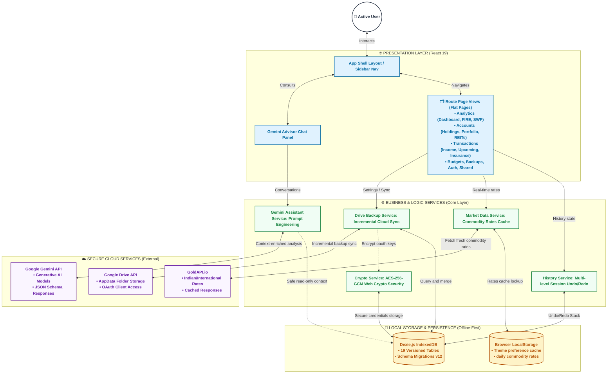

# 🧠 Antigravity (PWA Finance Elite SE Agent Context)

This file contains high-fidelity architectural memory and context for pair programming. Always keep it in sync with the codebase state.

## 🏗️ Project Architecture (Flattened & Simplified)
To keep the codebase simple and highly scalable for new developers, we have replaced the dual `domains/` and `shared/` directory hierarchy with a consolidated, clean, role-based architecture. All source files now live directly under well-defined, single-purpose directories in `src/`:

### 🏗️ Architecture Blueprint

### 📂 Directory Mapping

- `src/app/`: Root application bootstrappers, providers, central routing configurations (`App.tsx`, `main.tsx`), and core integration tests (`__tests__/`).
- `src/components/`: Reusable stand-alone UI elements and visual blocks, grouped logically by domain focus:
  - `common/`: Shared generic components (e.g., inputs, selectors, tables, confirmation modals, gauges, `CustomPieChart.tsx`).
  - `layout/`: Shell layout templates, error boundaries, core navigation bars, and undo/redo controls (`Layout.tsx`, `BasePage.tsx`).
  - `widgets/`: Dynamic standalone card widgets (e.g., gold rate calculator, gold rates widget, daily tips card).
  - `analytics/`, `backups/`, `budgets/`, `accounts/`, `auth/`, `ai/`: Cohesive components specific to these functional areas.
- `src/contexts/`: Shared React state providers (e.g., `themeContext.tsx`, `authContext.ts`, `bioLockContext.tsx`, `DashboardDataContext.tsx`).
- `src/data/`: Domain-agnostic static data files and mathematical constants (e.g., `financialTips.ts`, `reitData.ts`).
- `src/hooks/`: Shareable custom React hooks (e.g., `useMobile.ts`, `useUndoRedo.ts`, `useAuth.ts`, `useDashboardData.ts`).
- `src/infrastructure/`: Low-level services and configurations:
  - `db/`: Core IndexedDB definition, Dexie initialization, typescript definitions, and database migrations (`db.ts`, `db.types.ts`, `dbMigrations.ts`).
  - `crypto/`: Cryptographic Web Crypto API wrapper for biometric key derivation and local api credentials encryption.
- `src/pages/`: Page views representing route endpoints, flat and simple to find:
  - `analytics/`: Financial dashboard, FIRE page, asset projections, tools overview, and systematic withdrawal page (`SwpPage`).
  - `accounts/`: Portfolios, holdings, bank accounts, holders, asset classes, and REITs.
  - `transactions/`: Income flows, cash flow merging, upcoming expenses, insurances, and configuration types pages.
  - `budgets/`: Goals tracking and monthly category budget cards.
  - `backups/`: Google Drive sync panel, debug logs console, and DB query builder.
  - `auth/`: Login/Credential lock portal.
  - `shared/`: Generic core pages (e.g., about page, finance guidelines).
- `src/service-worker/`: PWA service worker configurations, Workbox cache layer, and registrations.
- `src/services/`: Shared business, networking, or cloud services (e.g., Google Drive client, Gemini API, Gold API cache, logging).
- `src/styles/`: Bootstrap overrides, CSS variables, and Sass modules (`main.scss`).
- `src/types/`: Centralized interface models (e.g., UI columns, custom type defs).
- `src/utils/`: Pure utilities (e.g., encryption helpers, Indian-to-international gold converter, number formatting, notification banners).

## 💾 Data Schema (Dexie.js)
The app uses IndexedDB via Dexie.js (Current Schema Version: **12**). Key tables and their purposes:
- `configs`: Encrypted local settings (API keys, theme choices, biometric keys, cloud status).
- `assetPurposes`: Asset purpose categories linked to goals.
- `loanTypes`: Predefined loan options with default interest rates.
- `assets`: User asset entries (amounts, categories, links to institutions).
- `liabilities`: User liabilities entries (interest rates, balances).
- `assetClasses`: Core asset groups (e.g., Equity, Debt, Cash).
- `assetSubClasses`: Subcategories (e.g., Mutual Funds, EPF, Gold).
- `sipTypes`: Systematic Investment Plan schedules.
- `sipHoldings`: Active monthly SIP contributions.
- `upcomingExpenses`: Recurring or future planned purchases.
- `insurances`: General and health insurance policies.
- `insuranceTypes`: Policies category definitions.
- `holders`: Registered wealth holder accounts.
- `buckets`: Envelope-method category allocation buckets.
- `goals`: Targeted financial milestones (e.g., lean-FIRE, house downpayment).
- `goalsBuckets`: Intersection mappings for budget allocations.
- `accounts`: Financial account containers.
- `reits`: Real Estate Investment Trusts with yields and holdings.
- `history`: Session-based operations queue supporting multi-level undo/redo operations.

## 🔐 Authentication & Security Flow
1. **Local Authentication (`BioLockProvider`)**:
   - Integrates biometrics/WebAuthn where possible, falling back to secure password configuration.
   - Encapsulates locks dynamically over core layout rendering when key configurations exist.
2. **Secrets Encryption (`src/utils/encryption.ts`)**:
   - Encrypts third-party config credentials (e.g., `GOLD_API_KEY`, Google Drive oauth tokens) inside IndexedDB using a derived key.
   - Utilizes PBKDF2 for key derivation and AES-256-GCM from Web Crypto API for secure hardware-accelerated encryption.

## 🔌 Core Integrations
- **Google Drive API**: Client-side versioned backup flow, performing automated background incremental JSON synchronization.
- **Gemini API**: Conversational financial advisor. Analyzes user net-worth breakdown, cash flow diagrams, and budget goals, delivering clean contextual text advice.
- **GoldAPI**: Real-time commodity updates for Indian and international rates (gold/silver) cached in `localStorage` for 24 hours.

## 🧪 Testing Suite Status
- **Test Command**: `npx vitest run` or `npm run test`
- **Current Health**: All 5 test suites containing 18 unit/integration tests are passing successfully.
- **Key Practices**: When updating components that trigger DB writes or auth actions, always wrap state transitions in React `act(...)`.
